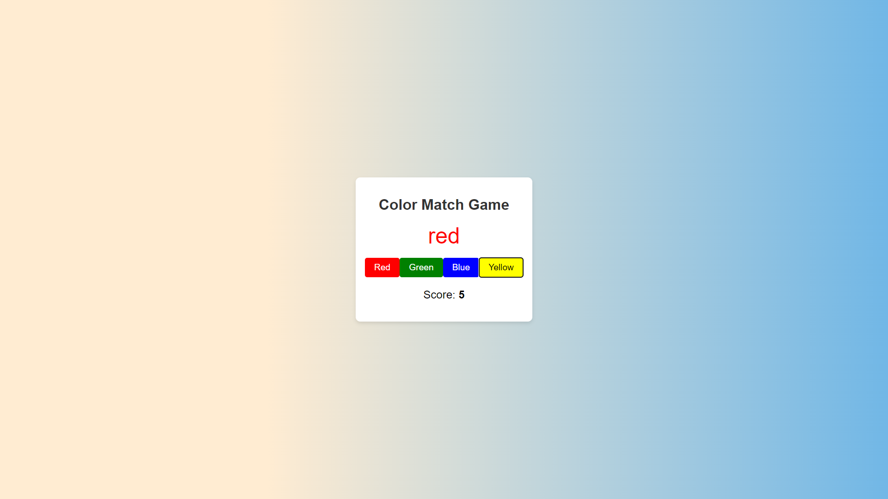

# Color Match Game

A simple and visually appealing color match game where the player has to match the color of the text with the correct color name displayed on buttons. The game is built using HTML, CSS, and JavaScript.

## Demo

You can play the game [here](https://inspiring-horse-569b03.netlify.app/).

## Features

- Visually appealing design.
- Interactive buttons to match the color.
- Score tracking to keep track of correct matches.

## Screenshots




## Installation

1. Clone the repository:
    ```bash
    git clone https://github.com/yourusername/color-match-game.git
    ```
2. Navigate to the project directory:
    ```bash
    cd color-match-game
    ```

## Usage

1. Open `index.html` in your web browser to start the game.
2. Match the color of the text with the correct color name displayed on the buttons.
3. The score will update based on your correct matches.


## Contributing

1. Fork the repository.
2. Create a new branch:
    ```bash
    git checkout -b feature-branch
    ```
3. Make your changes.
4. Commit your changes:
    ```bash
    git commit -m "Add new feature"
    ```
5. Push to the branch:
    ```bash
    git push origin feature-branch
    ```
6. Open a pull request..


